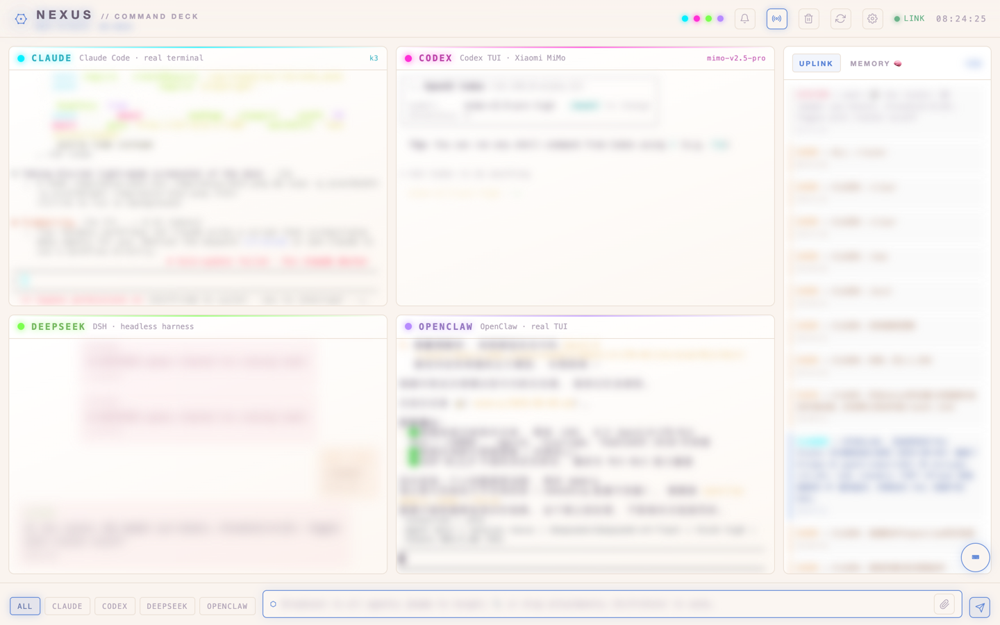

# NEXUS // Command Deck

**One browser tab to command your whole team of local CLI agents.**

NEXUS is a local command deck that puts any mix of CLI agents — Claude Code, Codex, DeepSeek Harness, OpenClaw, Hermes, or your own — behind a single cyberpunk WebUI: broadcast or @-target instructions, watch every agent in its own live window, let agents dispatch each other, and share a collective memory across the team. With a [TypeSafe Jev](https://typesafe.ai) key, unaddressed messages are routed to the right agent by a System One model instead of broadcast blindly.

[](https://typesafe.ai)   

English | [中文](README.zh-CN.md)



## Features

- **Agent matrix** — every agent gets a live window with status LED, latency, stop/reset controls; the roster is just a JSON file you control (1 agent or many)
- **Real terminal mode** — agents marked `terminal: true` embed a real interactive TUI via node-pty + xterm.js (e.g. a full Claude Code session you can also type into directly); explicit `cmd`/`args` supported (e.g. `openclaw tui`)
- **Live process streaming** — adapters can stream their working (not just the final reply): the dsh adapter listens to the running `dsh web` event stream and renders a live CoT transcript (reasoning + tool calls), frozen into a collapsible block when the reply lands
- **Broadcast & targeting** — send to everyone, or `@claude review this diff` to one; bottom chips make targeting one tap
- **Smart routing by [TypeSafe Jev](https://typesafe.ai)** *(optional)* — messages without an @-mention are classified by Jev, a System One decision model (~100ms, calibrated confidence), and unicasted to the best-matching agent; low confidence falls back to broadcast. See [Smart routing](#smart-routing-with-jev)
- **Agent-to-agent dispatch** — an agent can task another by writing `@<agent>: <task>` on its own line, via the `nexus ask` CLI, or `POST /api/agent/ask` (depth-capped to prevent loops)
- **Shared memory** — event-sourced `node:sqlite` store; `/remember`, `MEMO[kind]:` capture from agent replies, relevance-based recall injected into prompts, `/distill` staged candidates with an approval flow, full management UI
- **Sessions** — resume past conversations (`@claude /sessions`, `/resume <prefix>`), per-agent session continuity across restarts
- **Attachments** — drag / paste / 📎 files, images, audio, video up to 50 MB; Codex receives images as real vision input
- **Three macaron themes** — CYBER / LIGHT / DARK, Ghostty-style focus-mode translucency, installable as a PWA / Mac dock app
- **iPhone as a remote keyboard** — `/kb.html` turns a phone into a send-only keyboard for any terminal window: IME-aware keystroke forwarding, agent tabs, TUI special keys, and 📎 file upload (path typed straight into the terminal draft); the keybar's 📱 shows the setup link and glows while a phone is connected
- **iPad & phone ready** — terminals stack, the uplink feed becomes a slide-in drawer

## Requirements

- **macOS** (for the launchd background service; anywhere else, just run it in the foreground)
- **Node.js ≥ 22.5** — shared memory uses `node:sqlite` (≥ 23.4 recommended; the installer checks for you)
- **One `npm install`** — node-pty, ws, xterm. node-pty compiles natively, so have Xcode Command Line Tools (`xcode-select --install`)
- Whichever agent CLIs you actually want to drive — missing ones are simply skipped:

| Agent | CLI | Notes |
|---|---|---|
| Claude Code | `claude` | Official CLI; works with cc-switch channel switching |
| Codex | `codex` | Also auto-detected inside Codex.app |
| DeepSeek Harness | `dsh` | Talks to the local `dsh web` surface (launchd service `com.agent-nexus.dsh-web`) |
| OpenClaw | `openclaw` | Called through the local gateway `agent` subcommand; **never touches external IM channels** |
| Hermes | `hermes` | Third-party CLI agent; deck sessions are tagged `--source tool` so they stay out of your own session list |

## Quick start

```bash
git clone https://github.com/JMOKSZ/agent-nexus.git
cd agent-nexus
npm run setup        # = node bin/install.mjs
```

The interactive installer walks you through everything:

1. **Runtime check** — Node version + `node:sqlite` support
2. **Dependencies** — `npm install`, with Xcode CLT guidance if node-pty fails to build
3. **Assemble your team** — auto-detects installed agent CLIs, lets you opt each one in/out, add extra instances (e.g. a second `claude2`), then writes `~/.agent-nexus/agents.json` (existing file is backed up, never clobbered)
4. **Background service** — on macOS, installs a launchd service with your real node and repo paths (auto-start on login, restart on crash)
5. **Health check** — verifies the deck is actually serving before saying done

Then open **http://127.0.0.1:7700**.

Scriptable / CI-friendly:

```bash
node bin/install.mjs --yes                 # accept all defaults
node bin/install.mjs --no-launchd          # skip the background service
node bin/install.mjs --skip-deps           # skip npm install
printf 'y\nn\ny\n' | node bin/install.mjs  # piped answers work too
```

### Manual install (no wizard)

```bash
npm install
node server/index.mjs          # foreground
```

No `~/.agent-nexus/agents.json`? The deck falls back to the bundled `agents.example.json`.

Manual launchd setup (what the installer does for you):

```bash
sed "s|__HOME__|$HOME|g" launchd/com.agent-nexus.plist > ~/Library/LaunchAgents/com.agent-nexus.plist
# edit ProgramArguments if your node isn't /opt/homebrew/opt/node/bin/node
launchctl bootstrap gui/$(id -u) ~/Library/LaunchAgents/com.agent-nexus.plist
```

Day-to-day control: `bin/nexus start | stop | restart | logs` — logs live at `~/.agent-nexus/nexus.log`.

## Configure your team

`~/.agent-nexus/agents.json` is an array — one entry per window:

```json
[
  {
    "id": "claude",
    "name": "CLAUDE",
    "color": "#00f0ff",
    "desc": "Claude Code CLI",
    "adapter": "claude",
    "modelHint": "claude-sonnet-4-6 (empty = default)",
    "ctxChars": 900,
    "cwd": "~",
    "terminal": true,
    "args": ["--strict-mcp-config", "--mcp-config", "@repo/config/mcp-none.json"]
  }
]
```

| Field | Required | Meaning |
|---|---|---|
| `id` | ✓ | Unique, lowercase `[a-z0-9-_]` — used for @-targeting and dispatch |
| `name` | ✓ | Window title |
| `color` | ✓ | Accent color (hex) |
| `adapter` | ✓ | `claude` \| `codex` \| `dsh` \| `openclaw` \| `hermes` |
| `desc` | | Subtitle |
| `routeDesc` | | Responsibility blurb used by the Jev router (≤160 chars) — describe what the agent is *for* |
| `modelHint` | | Placeholder for the model field in Settings |
| `ctxChars` | | Shared-memory injection budget (0 = off, default 900) |
| `cwd` | | Working directory for the agent process |
| `terminal` | | Embed a real interactive TUI instead of headless runs |
| `cmd` / `args` | | Terminal mode only: command/args to spawn (default: agent id + `--model`/`extraArgs` from Settings). Explicit `args` replace the `--model` convention — e.g. `["tui", "--session", "nexus"]` for `openclaw tui`. `@repo/...` in args resolves into the repo directory, so a roster can reference bundled files portably — e.g. the shipped `config/mcp-none.json`, which starts Claude Code with no MCP servers for a much faster first paint |
| `distiller` | | This agent runs `/distill` jobs (default: first non-session adapter) |

- Fewer agents: delete entries. More of the same type: add an entry with a new `id`.
- Invalid ids or unknown adapters are skipped with a log warning.
- `NEXUS_AGENTS_FILE` points at a different roster file.
- Apply changes with `bin/nexus restart`.
- Tip: append `"--continue"` to claude's args to auto-resume the latest session whenever the window respawns (drop it on a fresh install — claude errors if no session exists yet).

Everything else — per-agent model & extra CLI args, theme, focus opacity — is set live from the **⚙ Settings** panel (stored in `~/.agent-nexus/settings.json`).

## Using the deck

| Action | How |
|---|---|
| Send | `Shift+Enter` or the send button (`Enter` = newline) |
| Target one agent | Click its chip, or start the message with `@codex …` |
| Focus mode | Click a window's title bar or single-select a chip; `Esc` to exit |
| Stop a running task | ⏹ in the window header, or `@agent /stop` |
| Reset a session | RESET in the window header, or `@agent /clear` |
| Attach files | 📎 button, drag & drop, or paste |

Slash commands — hub-level (work anywhere): `/remember` `/forget` `/memories` `/distill` `/clearall` `/router`.
Agent-level (prefix with `@agent`): claude & codex support `/sessions` `/resume <prefix>` `/fork` `/status` `/clear` `/stop`; dsh & openclaw support `/status` `/clear` `/stop`; hermes supports `/sessions` `/resume <prefix>` `/status` `/clear` `/stop`. In terminal windows, slash commands are typed straight into the TUI.

## iPhone as a remote keyboard

Typing into a terminal on an iPad is cramped — let your iPhone be the keyboard. With the deck open on the iPad (or Mac), tap **📱** on the soft keybar: the popover shows the phone URL and a live connection status. Open that URL on the phone (`https://<machine>.<tailnet>.ts.net:8443/kb.html` via Tailscale Serve — see below; add it to the Home Screen for one-tap access).

- Keystrokes are forwarded into the selected terminal window as you type — IME-aware, so CJK composition commits as one chunk instead of letter soup
- Agent tabs choose which terminal receives input; soft-keyboard return types a newline into the TUI draft, the fixed ⏎ key submits, and ESC / arrows cover TUI navigation
- 📎 uploads a file (≤ 50 MB) and types its path into the terminal draft — add instructions, hit ⏎
- The phone is an input-only client: it receives no terminal output, so it adds no load to an already-busy session. The 📱 key on the deck glows while a phone is connected, and its popover shows which windows have phones attached

## Smart routing with Jev

By default, a message with no `@target` goes to **every** agent. With smart routing enabled, the deck asks [Jev](https://typesafe.ai) — TypeSafe's System One model for fast, structured, calibrated decisions — which agent should handle it, and sends it there alone.

- **Calibrated confidence gating** — each route comes with a confidence score; below the threshold (or when Jev itself picks "broadcast", e.g. chit-chat or multi-agent tasks) the message broadcasts as before. Router errors fail open to broadcast — the deck never eats a message
- **Fast and nearly free** — a routing call adds ~100ms and fractions of a cent (input tokens only; Jev outputs are unmetered)
- **Per-agent `routeDesc`** — routing keys off each agent's `routeDesc` responsibility blurb in `agents.json` (see the [config table](#configure-your-team)); write what the agent is *for*, not what it *is*
- **Runtime toggle** — `/router on|off` in any window, `/router` shows status

Setup — `~/.agent-nexus/router.json`:

```json
{
  "enabled": true,
  "model": "jev-latest",
  "threshold": 0.55,
  "proxy": "http://127.0.0.1:7897"
}
```

The API key comes from `apiKey` in that file, `TYPESAFE_API_KEY`, or `~/.config/typesafe/api_key` (get one at [console.typesafe.ai](https://console.typesafe.ai)). `proxy` is optional (default `http://127.0.0.1:7897`, or `HTTPS_PROXY`). Messages with attachments always broadcast. Restart with `bin/nexus restart` after changing the file.

## Agent-to-agent dispatch

Agents can task each other three ways:

- **In a reply**: a line reading `@<agent>: <task>` is forwarded automatically (fire-and-forget, depth limit 4)
- **CLI**: `nexus ask <agent> "<task>"` — blocks and prints the reply (`NEXUS_ASK_FROM=<id>` sets the sender)
- **HTTP**: `curl -X POST 127.0.0.1:7700/api/agent/ask -H 'Content-Type: application/json' -d '{"from":"codex","to":"dsh","text":"…"}'`

Terminal agents (e.g. a live Claude Code TUI) receive tasks as typed input — they're truly interactive, so replies can't be captured synchronously.

## Data locations

| Path | Contents |
|---|---|
| `~/.agent-nexus/agents.json` | Your team roster |
| `~/.agent-nexus/router.json` | Jev smart-routing config (optional) |
| `~/.agent-nexus/settings.json` | Models, args, theme, opacity |
| `~/.agent-nexus/state.json` | Message history & sessions |
| `~/.agent-nexus/nexus.db` | Shared memory (SQLite) |
| `~/.agent-nexus/uploads/` | Uploaded attachments |
| `~/.agent-nexus/nexus.log` | Service logs |

## Security

The server binds to **127.0.0.1 only and has no authentication**. Do not expose it through a reverse proxy or port forward. The OpenClaw adapter never delivers to Telegram or any external channel; the DSH adapter drives the local `dsh web` surface (127.0.0.1:3080) and never touches the separate `dsh --profile lark` process.

### Tailscale / LAN access

The recommended way to reach the deck from other devices on your Tailscale network (iPad / iPhone) is Tailscale Serve, which gives you a valid HTTPS URL (no browser "Not secure" warning):

    tailscale serve --bg 7700

Then open **`https://<machine>.<tailnet>.ts.net/`** from the device. The server can stay bound to `127.0.0.1` (default), since Tailscale Serve proxies to the local port.

Alternative: set `NEXUS_HOST=0.0.0.0` (or a specific Tailscale IP like `100.x.y.z`) in the launchd plist / startup environment and open `http://<tailscale-ip>:7700` from the device. Note the deck has no auth and this is plain HTTP — binding `0.0.0.0` also exposes it to your LAN subnet, so prefer the HTTPS Serve route above.

To tell machines apart on a home screen, set `NEXUS_ICON_THEME=light` for a light-background PWA icon (manifest + apple-touch-icon switch together); the default stays dark.

## Project structure

```
server/
  index.mjs            # HTTP + SSE + WS service (127.0.0.1:7700)
  hub.mjs              # routing, per-agent queues, dispatch, slash commands, distill jobs
  router.mjs           # Jev (System One) smart routing for unmentioned messages
  terminal.mjs         # node-pty real terminals (bracketed paste, cc-switch model env)
  agents-config.mjs    # roster loading (~/.agent-nexus/agents.json)
  memory.mjs           # shared memory (node:sqlite, event-sourced)
  runner.mjs           # CLI spawn wrapper (timeout / line callbacks)
  settings.mjs         # settings persistence
  adapters/            # claude / codex / dsh / openclaw / hermes + registry
web/                   # zero-build vanilla JS + hand-written CSS, PWA (index.html + kb.html phone keyboard)
config/                # bundled config snippets for @repo/ args (mcp-none.json = MCP-free claude start)
bin/install.mjs        # interactive installer
bin/nexus              # service control + agent dispatch CLI
launchd/               # plist template
```

## License

MIT
